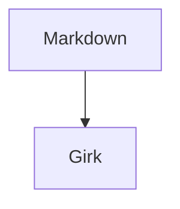

# Markdown

Girk renders Markdown with Nizel and enables the first-party plugins that are useful for documentation, long-form pages, and technical reference sites.

## Core Markdown

You can use normal Markdown for headings, paragraphs, emphasis, links, images, lists, blockquotes, tables, task lists, strikethrough, inline code, and fenced code blocks.

Headings get stable `id` attributes, and visible heading anchor links are added so readers can copy section links.

```markdown
## Install

Use `npm install`.
```

Bare URLs and email addresses are converted into links:

```markdown
Visit https://example.com or email hello@example.com.
```

## Callouts

GitHub-style alerts are supported:

```markdown
> [!NOTE]
> This is useful background information.

> [!WARNING]
> This action has consequences.
```

## Definition Lists

Definition lists use the term-plus-definition syntax:

```markdown
Girk
: A Markdown-first static site generator.

Nizel
: The Markdown processor used by Girk.
```

## Emoji

Emoji shortcuts are supported:

```markdown
Ship it :rocket:
```

## Code Blocks

Fenced code blocks are syntax highlighted with Shiki. Girk also adds a copy button to code blocks and wires it to the browser Clipboard API.

````markdown
```ts
const message = "hello";
```
````

The copy button works in browsers that allow `navigator.clipboard`. If the browser blocks clipboard access, the button reports the failure without breaking the page.

## Details Blocks

Use details blocks for expandable content:

```markdown
:::details More information
Hidden **Markdown** content.
:::
```

## Table Of Contents

Place a standalone `[[toc]]` marker where you want a local table of contents:

```markdown
[[toc]]

## First Section

## Second Section
```

The generated TOC links to the page headings.

## Footnotes

Footnotes use reference syntax:

```markdown
This sentence has a note.[^one]

[^one]: The note text.
```

## Citations

Citations use `[@id]` references and definition lines:

```markdown
This paragraph cites a source [@smith2026].

[@smith2026]: Smith, A. Markdown Rendering Notes, 2026.
```

Girk appends a bibliography section for known citations. Unknown citation IDs are left as text.

## Abbreviations

Define abbreviations once and use the term in prose:

```markdown
*[HTML]: HyperText Markup Language

HTML is used for page structure.
```

## Typography Extensions

Girk supports explicit inline typography helpers:

```markdown
==highlighted text==
H~2~O
E = mc^2^
```

These render as `<mark>`, `<sub>`, and `<sup>`.

## Math

Inline and display math render from TeX source:

```markdown
Inline math: $E = mc^2$

$$
f(x) = x^2
$$
```

Girk preserves the TeX source inside `.math` elements and conditionally loads KaTeX only on pages that contain math.

## Diagrams

Mermaid fences are converted into Mermaid diagrams:

````markdown

````

Girk outputs `.mermaid` elements and conditionally loads Mermaid only on pages that contain diagrams.

## Media Figures

A standalone image becomes a figure with a caption from the image alt text:

```markdown

```

Inline images stay inline. Standalone images get lazy-loading and async decoding attributes when they are missing.

## Frontmatter UI Blocks

Use a `::frontmatter` block when you want to render key-value metadata inside page content:

```markdown
::frontmatter
title: API Reference
status: Draft
::
```

This is separate from the YAML frontmatter at the top of a page. YAML frontmatter controls Girk page behavior; `::frontmatter` renders visible content.

## Sanitizing

Girk enables Nizel safe rendering and a final sanitizing pass for generated HTML. The sanitizer removes common risky patterns such as script/style blocks, inline event handlers, and `javascript:` URLs.

This is a hardening layer, not a replacement for platform-level restrictions when rendering hostile untrusted content.

## Compatibility Notes

- `nizel-plugin-gfm` is not listed separately because Girk enables its concrete plugins directly: alerts and autolinks.
- Math pages load KaTeX from the pinned Girk runtime, and diagram pages load Mermaid from the pinned Girk runtime. Pages without those features do not load those assets.
- Keep `::frontmatter` blocks separate from footnote definitions. They are both block-level extensions and are most predictable when they are not adjacent in the same block sequence.

## Related

- [Imports](/features/imports/index.html)
- [Media and Assets](/features/media/index.html)
- [Page Frontmatter](/features/metadata/index.html)
- [Customisation](/features/customisation/index.html)
